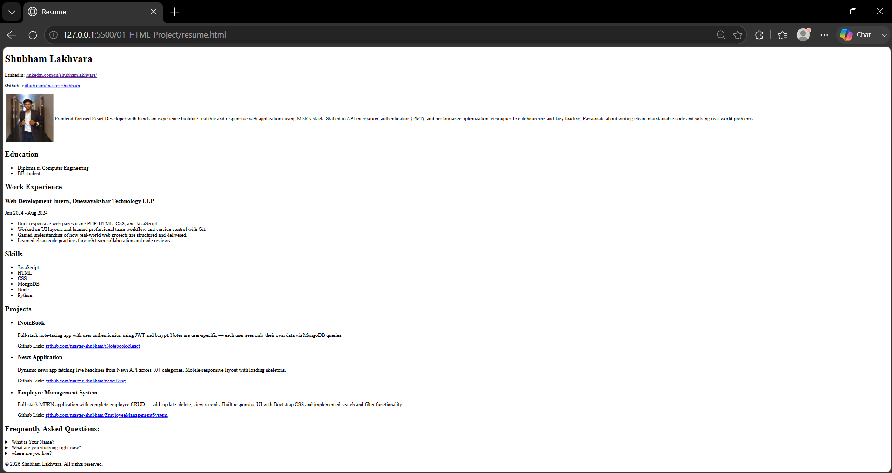
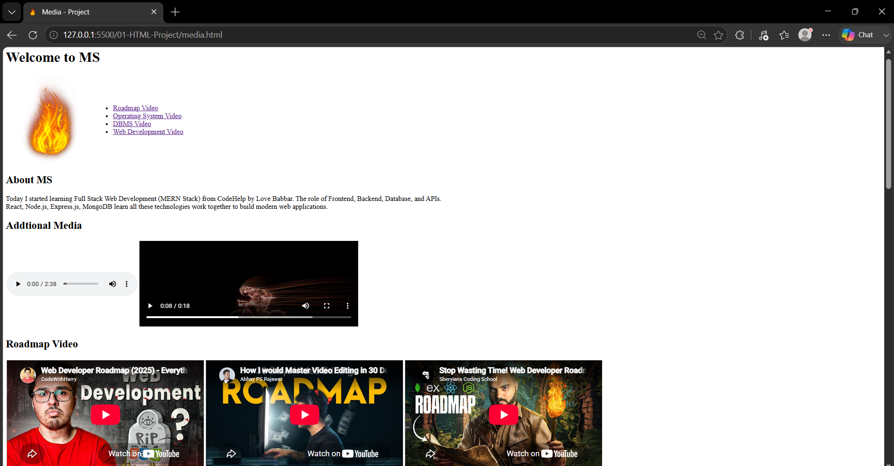
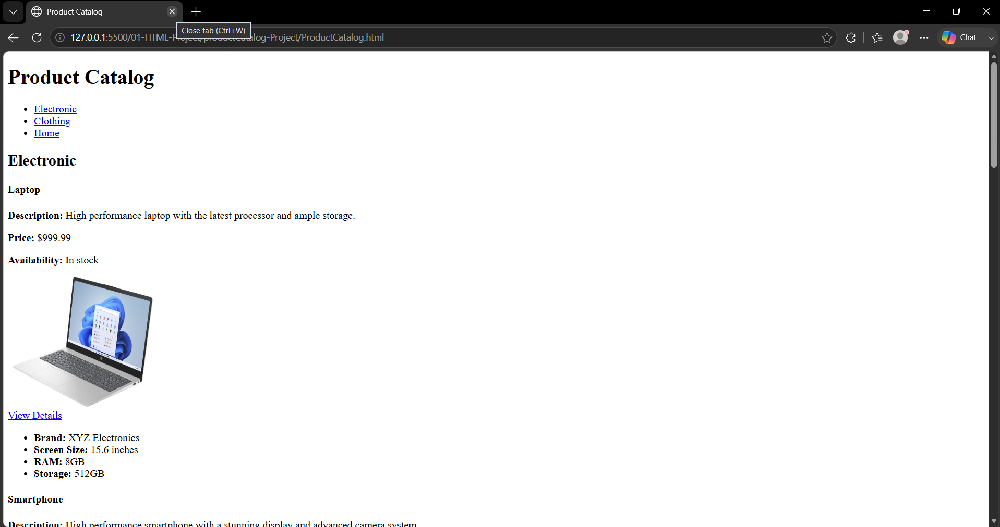

# 🌐 HTML Fundamentals

This folder contains the projects I built while learning **HTML5**.

The main objective was to understand how to create well-structured web pages before moving on to CSS and JavaScript.

---

# 📚 Topics Covered

- HTML Document Structure
- Semantic HTML
- Headings & Paragraphs
- Lists
- Hyperlinks
- Images
- Tables
- Forms
- Audio & Video
- iframe
- SEO Basics
- Meta Tags
- Favicon
- Internal Navigation (`id` & Anchor Tags)

---

# 💻 Projects

## 📄 1. Resume Project

### Preview

### Features

- Semantic HTML
- Lists
- Images
- Hyperlinks
- Details & Summary
- Clean document structure

---

## 🎬 2. Media Project

### Preview

### Features

- Audio
- Video
- iframe
- Internal Page Navigation
- Embedded YouTube Videos

---

## 🛍️ 3. Product Catalog

### Preview

### Features

- Product Sections
- Images
- Hyperlinks
- Internal Navigation
- Structured Layout

---

# 🚀 Skills Practiced

- Writing semantic HTML
- Building multi-section webpages
- Embedding multimedia
- Organizing content
- Internal navigation using anchor links
- Creating accessible page structures

---

# 🎯 Next Step

➡️ Learn **CSS** and improve these projects with styling, layout, and responsiveness.

---

Happy Coding! 🚀