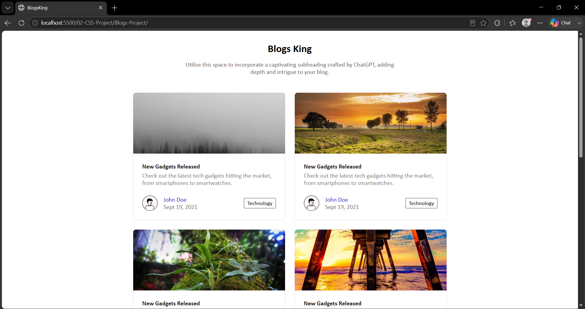
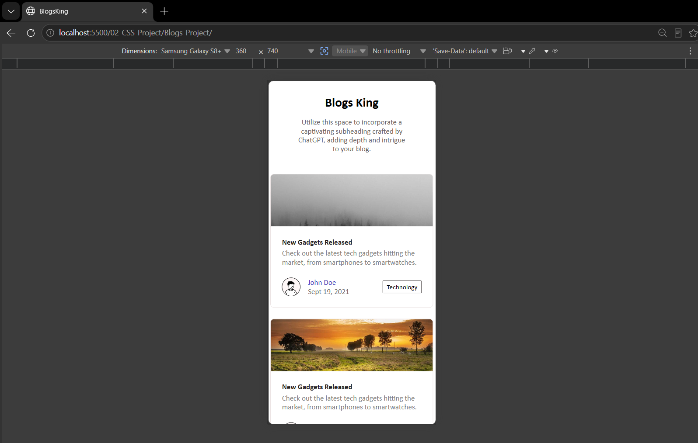

# 📖 Blogs King Website

A simple blog King website built using **HTML5** and **CSS3** to practice webpage structure and responsive layouts.

## 🚀 Features

- Responsive Navigation Bar
- Blog Cards
- Featured Articles
- Responsive Layout
- Footer Section

## 🛠️ Technologies Used

- HTML5
- CSS3
- Flexbox
- CSS Grid

## 📸 Preview

> Page 1

> Page 2

## 📚 What I Learned

- Semantic HTML
- Responsive Design
- Flexbox
- CSS Grid
- Card Layouts

## 🎯 Future Improvements

- Dark Mode
- Search Functionality
- Blog Details Page

## 👨‍💻 Author

**Shubham**

GitHub: https://github.com/master-shubham