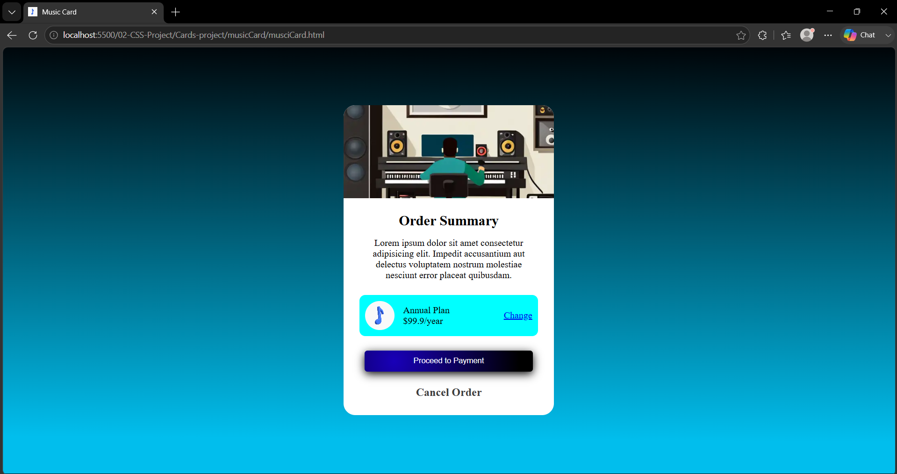
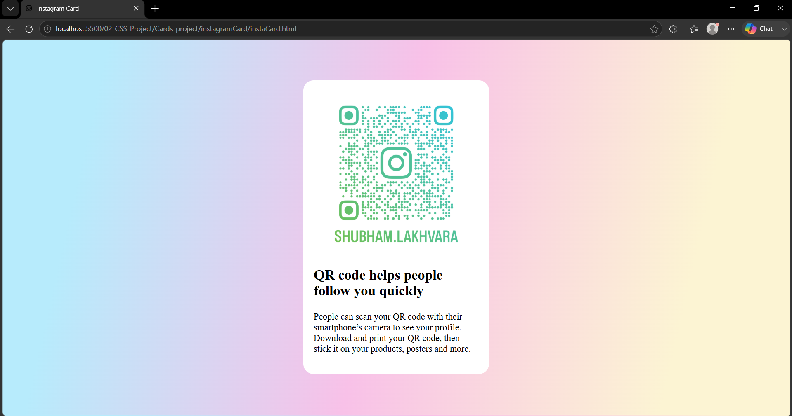

# 🎵 Card UI Collection

A collection of responsive card components built using **HTML5** and **CSS3**.

## 🚀 Cards Included

- 🎵 Music Card
- 📸 Instagram Card

## 🛠️ Technologies Used

- HTML5
- CSS3
- Flexbox

## 📸 Preview

> Music Page

> Instagram Page

## 📚 Concepts Practiced

- Card Design
- Box Shadow
- Border Radius
- Hover Effects
- Typography
- Button Styling

## 🎯 Future Improvements

- CSS Animations
- Responsive Card Grid

## 👨‍💻 Author

**Shubham**

GitHub: https://github.com/master-shubham