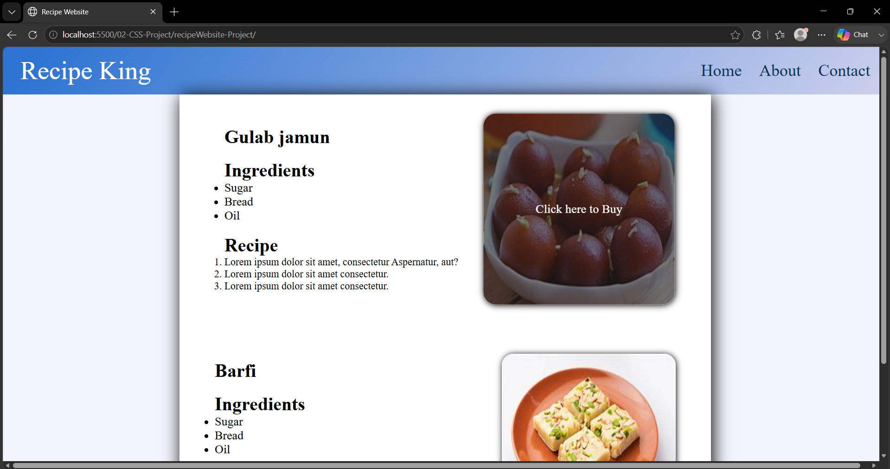

# 🍽️ Recipe Website

A recipe website built using HTML and CSS.

## 🚀 Features

- Recipe Cards
- Ingredients Section
- Cooking Instructions
- Responsive Layout
- Beautiful Typography

## 🛠️ Technologies Used

- HTML5
- CSS3
- Flexbox

## 📸 Preview

> Recipe Website

## 📚 Concepts Practiced

- CSS Layout
- Images
- Lists
- Typography
- Responsive Design

## 🎯 Future Improvements

- Search Recipes
- Categories
- Dark Mode

## 👨‍💻 Author

**Shubham**

GitHub: https://github.com/master-shubham