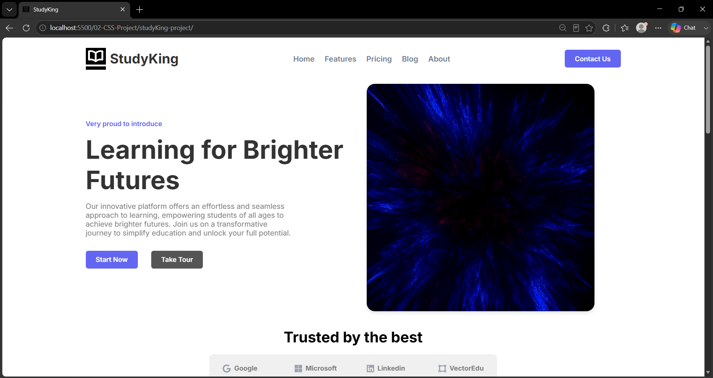
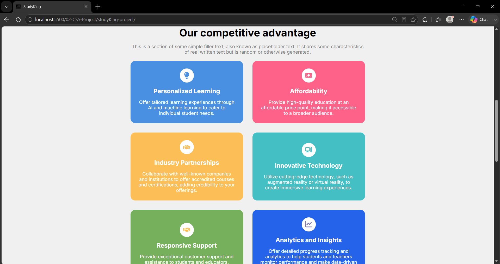
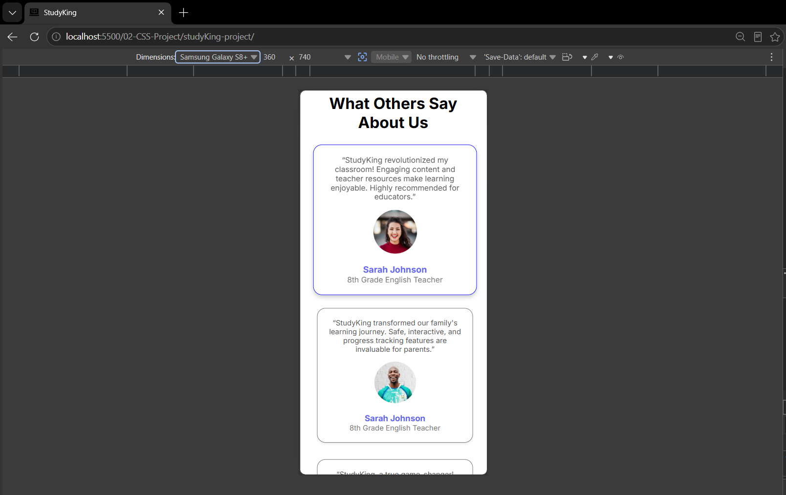
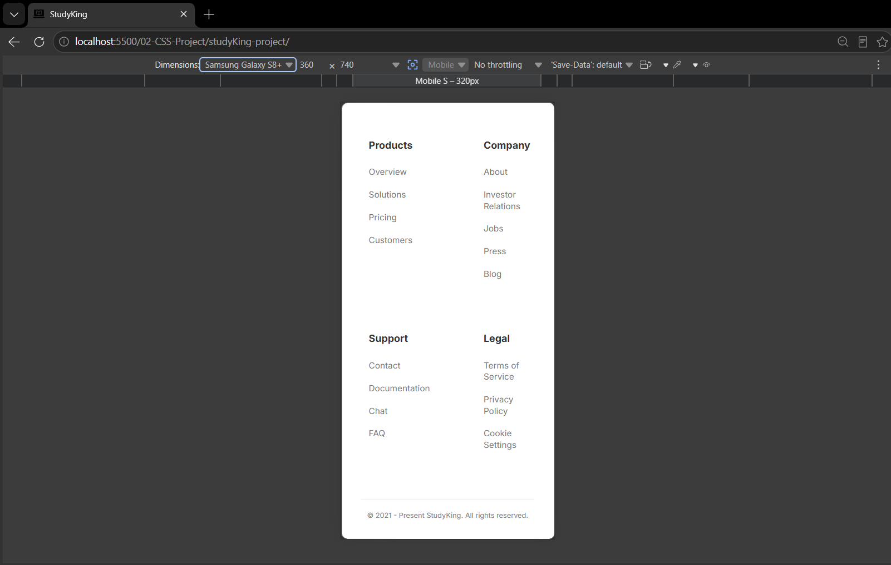

# 📚 StudyKing - Responsive Landing Page

StudyKing is a fully responsive landing page built using **HTML5** and **CSS3**.

This project focuses on modern webpage layout techniques and responsive design.

## 🚀 Features

- Responsive Navigation
- Hero Section
- Feature Cards
- Testimonials
- Newsletter Section
- Footer
- Mobile Responsive Design

## 🛠️ Technologies Used

- HTML5
- CSS3
- Flexbox
- CSS Grid
- Media Queries
- CSS Variables

## 📸 Preview

> Home

> page 2

> page 3

> page 4

## 📚 Concepts Practiced

- Semantic HTML
- Responsive Web Design
- Flexbox
- CSS Grid
- CSS Variables
- Hover Effects
- Media Queries

## 🎯 Future Improvements

- JavaScript Navigation Menu
- Dark Mode
- Smooth Scrolling
- Animations

## 👨‍💻 Author

**Shubham**

GitHub: https://github.com/master-shubham