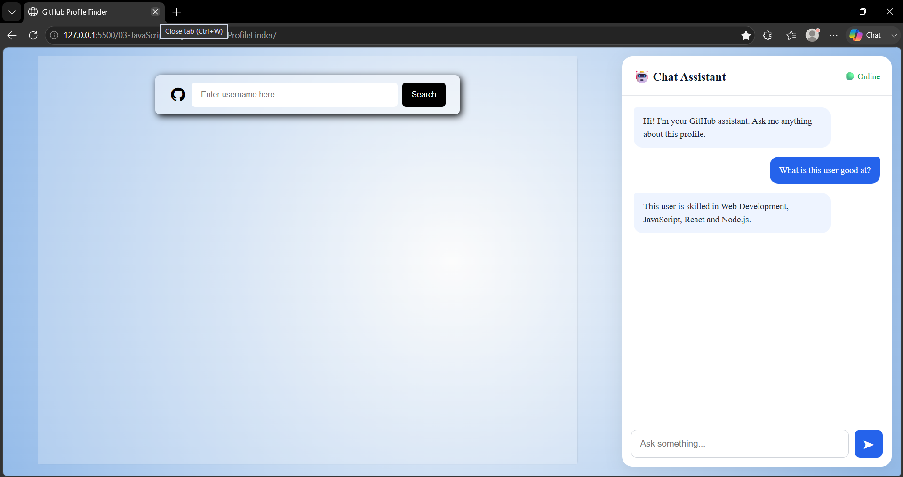
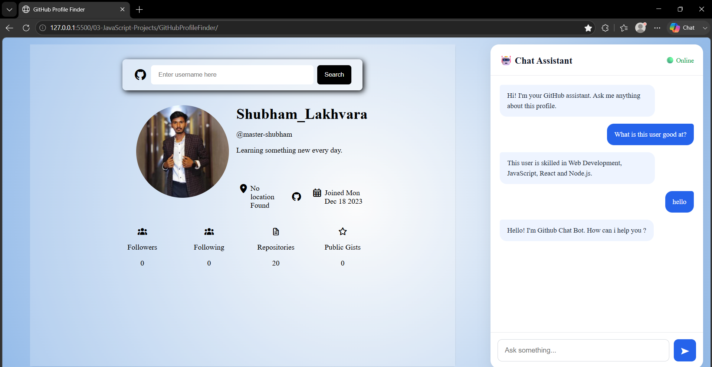
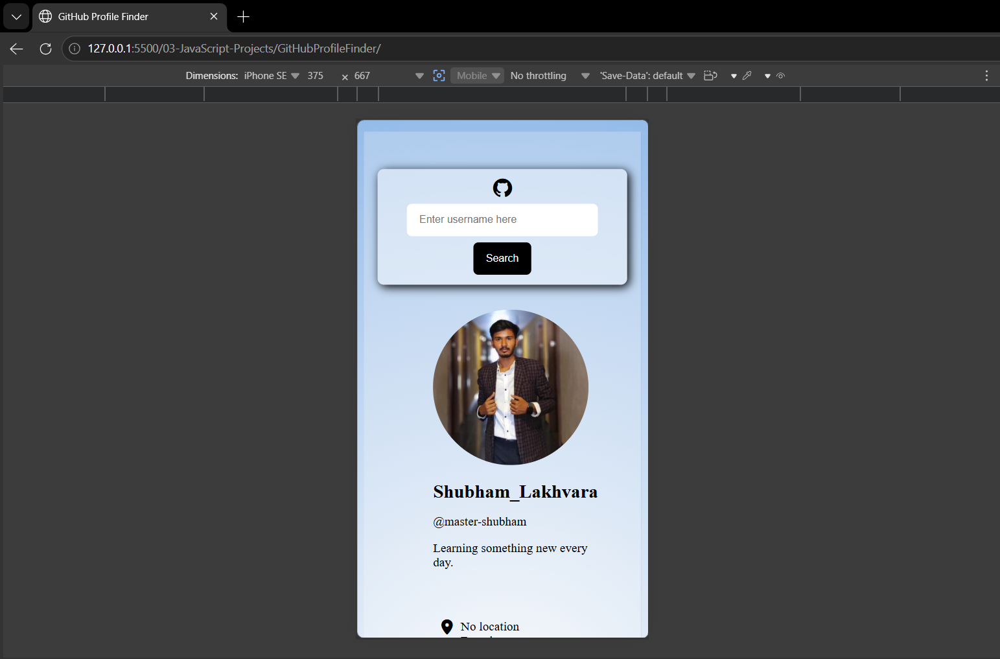

# 🐙 GitHub Profile Finder

GitHub Profile Finder is a web application built with **HTML, CSS, and JavaScript** that allows users to search for any GitHub profile by username and view important profile information and social statistics.

The project also includes a **Chat Assistant UI** designed to provide an interactive way to ask questions about the displayed GitHub profile.

## 📸 Project Preview

Home page


Profile page


Responsive page



## 📂 Project Structure

```text
GitHubProfileFinder/
│
├── index.html
├── styles.css
├── script.js
├── photoin.jpg
└── README.md
```

## ✨ Features

* 🔎 Search GitHub users by username
* 👤 Display GitHub profile information
* 🖼️ Display profile avatar
* 📝 Display user's name, username, and bio
* 📍 Display user's location
* 🔗 Direct link to the user's GitHub profile
* 📅 Display GitHub account creation date
* 👥 Display followers and following
* 📁 Display public repositories
* ⭐ Display public gists
* ⏳ Loading animation while fetching data
* ❌ Username validation
* 🔔 Toast notifications for errors
* ⚠️ Handle GitHub API errors
* 🤖 Chat Assistant UI
* 📱 Responsive layout for smaller screens

The profile data and statistics are populated dynamically from the GitHub API.

## 🛠️ Technologies Used

* **HTML5** – Structure of the application
* **CSS3** – Styling, responsive layout and animations
* **JavaScript (ES6+)** – Application logic and DOM manipulation
* **GitHub REST API** – Fetching GitHub user information
* **Fetch API** – Making API requests
* **Toastify.js** – Displaying notifications
* **Font Awesome** – Icons

The application requests user data from the GitHub users endpoint:

```text
https://api.github.com/users/{username}
```

GitHub provides REST API endpoints for retrieving user information.

## 📊 Profile Information

After searching for a username, the application displays:

### 👤 Profile Details

* Profile Avatar
* Name
* GitHub Username
* Bio
* Location
* GitHub Profile Link
* Account Creation Date

### 📈 Social Statistics

| Statistic       | Description                   |
| --------------- | ----------------------------- |
| 👥 Followers    | Number of followers           |
| 👤 Following    | Number of accounts followed   |
| 📁 Repositories | Number of public repositories |
| ⭐ Public Gists  | Number of public gists        |

These values are retrieved from the GitHub API response and dynamically inserted into the page using JavaScript.

## 🔄 How It Works

```text
Enter GitHub Username
          ↓
    Validate Username
          ↓
      Fetch GitHub API
          ↓
      Receive User Data
          ↓
    Process API Response
          ↓
  Display Profile Details
          ↓
 Display Social Statistics
```

The application validates the entered username before making the request. It also handles different API responses such as user not found, rate-limit errors, server errors, and network failures.

## 🔐 Username Validation

The project validates GitHub usernames using a regular expression before sending the API request.

It also checks whether the input is empty.

```javascript
function validateUsername(username) {
    // Validate GitHub username
}
```

Invalid usernames and empty input are displayed using Toastify notifications.

## ⚠️ Error Handling

The application handles several API scenarios:

* ❌ User doesn't exist — `404`
* ⚠️ GitHub API rate limit exceeded — `403`
* 🔴 GitHub server error — `500+`
* 🌐 Network/API connection error
* ⚠️ Other unexpected errors

This makes the application more reliable when working with an external API.

## 🤖 Chat Assistant

The project also contains a **Chat Assistant interface** alongside the GitHub profile section.

The assistant UI includes:

* 🤖 Bot messages
* 👤 User messages
* 🟢 Online indicator
* 💬 Chat message area
* ⌨️ Chat input
* ➤ Send button

The current interface provides the foundation for adding AI-powered profile analysis in the future.

## 🧠 JavaScript Concepts Practiced

While building this project, I practiced:

* DOM Selection
* DOM Manipulation
* Event Listeners
* Functions
* Regular Expressions
* Input Validation
* `fetch()`
* REST APIs
* `async/await`
* Promises
* `try...catch...finally`
* HTTP Status Code Handling
* JSON Data
* Dynamic Content Rendering
* Template Literals
* Conditional Rendering
* Date Formatting
* Responsive UI interaction

## 🎨 UI & Responsive Design

The application uses a clean profile dashboard with:

* Gradient background
* Profile card
* Social statistics section
* Loading animation
* Chat assistant panel
* Responsive layouts

The layout adapts for smaller screens using CSS media queries.

## 🚀 How to Run Locally

### 1. Clone the repository

```bash
git clone https://github.com/master-shubham/web-development-journey.git
```

### 2. Navigate to the project

```bash
cd web-development-journey/03-JavaScript-Projects/GitHubProfileFinder
```

### 3. Run the project

Open `index.html` in your browser.

For development, you can also use the **Live Server** extension in VS Code.

## 📚 What I Learned

This project helped me understand how to work with a real-world REST API and convert API responses into useful UI components.

I learned how to:

* Make API requests using `fetch()`
* Work with asynchronous JavaScript
* Handle API errors
* Validate user input
* Dynamically update the DOM
* Display external data in a user-friendly interface
* Build responsive layouts
* Create loading and notification states

GitHub recommends making project READMEs easy to understand by including features, setup instructions, demos, and other information that helps people quickly explore a project.

## 👨‍💻 Author

**Shubham Lakhvara**

* GitHub: [@master-shubham](https://github.com/master-shubham)
* LinkedIn: [Shubham Lakhvara](https://www.linkedin.com/in/shubhamlakhvara/)

## ⭐ Support

If you found this project useful or interesting, consider giving the repository a ⭐ on GitHub.

---

### 📌 Part of My Web Development Journey

This project is part of my **JavaScript Projects** collection, where I practice JavaScript by building practical, real-world web applications.
