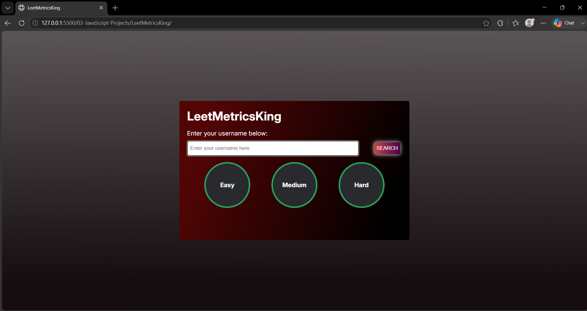
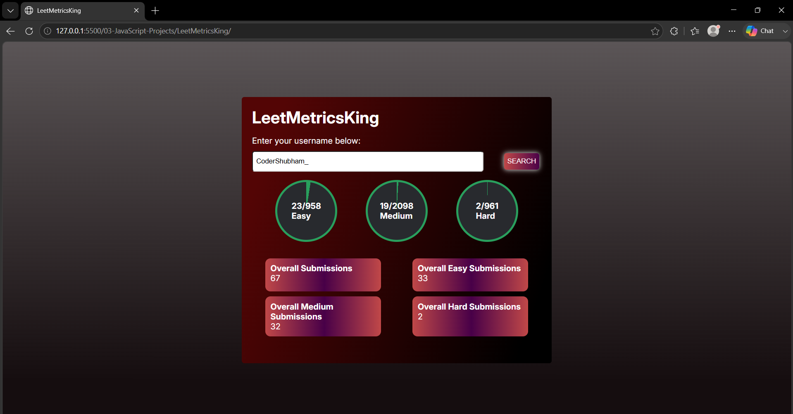

# 🚀 LeetMetricsKing

LeetMetricsKing is a simple and interactive **LeetCode Profile Metrics Tracker** built using **HTML, CSS, and JavaScript**.

Enter a LeetCode username and the application fetches the user's profile statistics and displays their solved problems and submission data in an easy-to-understand dashboard.

## 📸 Project Preview

> LeetMetricsKing Website



> Fetch Data Page




## 📂 Project Structure

```text
LeetMetricsKing/
│
├── index.html
├── styles.css
├── script.js
├── website-img/
└── README.md
```

## ✨ Features

* 🔎 Search LeetCode users by username
* 📊 Display solved problems by difficulty

  * 🟢 Easy
  * 🟡 Medium
  * 🔴 Hard
* 📈 Circular progress indicators
* 📋 Display overall submission statistics
* ⚡ Fetch data dynamically using JavaScript
* ❌ Username validation
* 🔔 Toast notifications for invalid input
* ⏳ Loading state while fetching user data
* 📱 Responsive and clean UI

## 🛠️ Technologies Used

* **HTML5** – Structure of the application
* **CSS3** – Styling, gradients, progress circles and layout
* **JavaScript (ES6+)** – DOM manipulation, API requests and dynamic rendering
* **Fetch API** – Fetching LeetCode profile data
* **Toastify.js** – Displaying user notifications
* **LeetCode API** – Retrieving profile statistics

## 📊 Statistics Displayed

For a searched LeetCode user, the dashboard displays:

### Problem Solving Progress

| Difficulty | Information    |
| ---------- | -------------- |
| 🟢 Easy    | Solved / Total |
| 🟡 Medium  | Solved / Total |
| 🔴 Hard    | Solved / Total |

### Submission Statistics

* Overall Submissions
* Overall Easy Submissions
* Overall Medium Submissions
* Overall Hard Submissions

The application dynamically creates the statistics cards from the API response.

## 🔄 How It Works

```text
Enter LeetCode Username
          ↓
    Validate Username
          ↓
      Fetch API Data
          ↓
    Receive User Stats
          ↓
   Process Statistics
          ↓
Display Progress + Cards
```

The application validates the username before making the API request and then uses the returned profile data to update the progress circles and statistics cards.

## 🔌 API

This project uses the **Alfa LeetCode API** to retrieve profile information.

The application sends a request using the following pattern:

```text
https://alfa-leetcode-api.onrender.com/{username}/profile
```

The API response is then processed using JavaScript to extract the required statistics.

## 🧠 JavaScript Concepts Practiced

This project helped me practice several important JavaScript concepts:

* DOM Selection
* DOM Manipulation
* Event Listeners
* Functions
* Arrays and Objects
* Array `map()`
* Template Literals
* Regular Expressions
* `async/await`
* `fetch()`
* Promises
* Error Handling with `try...catch...finally`
* Dynamic HTML Rendering
* CSS Custom Properties from JavaScript

## 🎨 UI

The application uses a dark-themed interface with gradient backgrounds and circular progress indicators to present the user's LeetCode statistics visually.

## 🚀 How to Run Locally

### 1. Clone the repository

```bash
git clone https://github.com/master-shubham/web-development-journey.git
```

### 2. Navigate to the project

```bash
cd web-development-journey/03-JavaScript-Projects/LeetMetricsKing
```

### 3. Run the project

Open `index.html` in your browser.

You can also use the **Live Server** extension in VS Code for a better development experience.


## 📚 What I Learned

While building this project, I learned how to work with an external API and use the returned data to dynamically update a web page.

I also practiced asynchronous JavaScript, input validation, error handling, DOM manipulation, and dynamically generating HTML elements using JavaScript.

## 🔮 Future Improvements

Some features that could be added in the future:

* [ ] Add LeetCode ranking
* [ ] Display acceptance rate
* [ ] Display contest rating
* [ ] Add recent submissions
* [ ] Add streak information
* [ ] Add profile avatar
* [ ] Add dark/light theme
* [ ] Improve mobile responsiveness
* [ ] Add more detailed user statistics

## 👨‍💻 Author

**Shubham Lakhvara**

* GitHub: [@master-shubham](https://github.com/master-shubham)
* LinkedIn: [Shubham Lakhvara](https://www.linkedin.com/in/shubhamlakhvara/)

## ⭐ Support

If you found this project useful or interesting, consider giving the repository a ⭐ on GitHub.

---

### 📌 Part of My Web Development Journey

This project is part of my **JavaScript Projects** collection, where I practice JavaScript concepts by building real-world projects.
